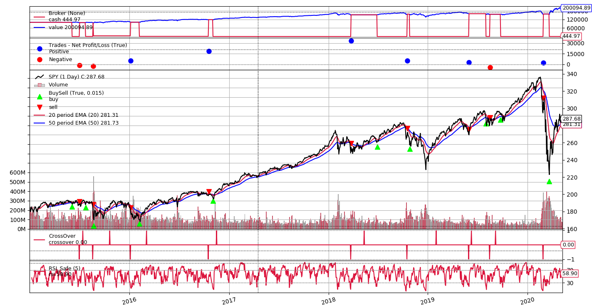

# Stock Trading Bot
Trading bot operating through Alpaca API & brokerage, using strategy based on RSI and Exponential Moving Average Indicators and streaming polygon.io market data through websockets.

# Backtesting results:
The 5 year backtest on SPY stock produced on average 20% in returns a year, whereas the stock itself has a yearly return average of just under 10%. 



Features to come:
- backtesting on intraday data
- optimization of parameters for indicators in backtrader
- stock screener for filtering based on performance

# To run:

Fill in variables in config.py and run:
```
python run.py
```
